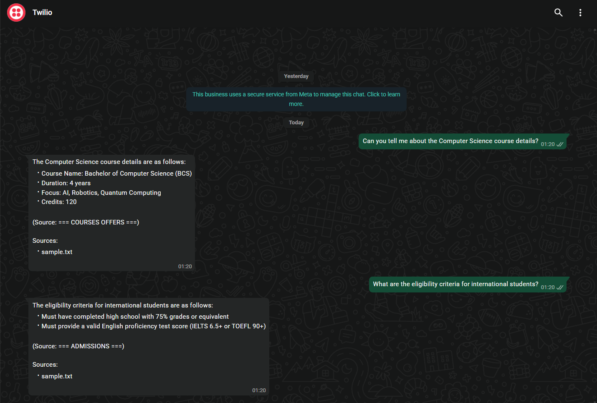
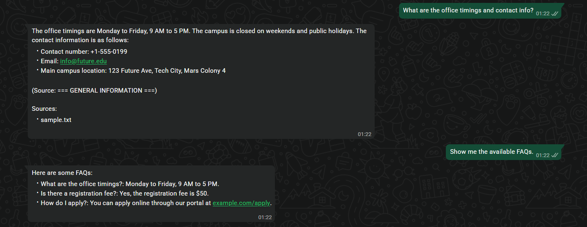

# WhatsApp RAG Chatbot (Docs + DB)




A WhatsApp-integrated chatbot that answers user questions using **Retrieval-Augmented Generation (RAG)** from uploaded documents (PDF/TXT) and fetches structured data from an SQL database (e.g., FAQs, Student Queries).  
Designed to run using CPU embeddings and the **Groq API** for ultra-fast, free LLM inference.

---

## ✨ Key Features
- ✅ **WhatsApp Integration**: Communicates via Twilio Sandbox.
- ✅ **RAG Pipeline**: Retrieves answers from local `.txt` documents (FAISS + Sentence Transformers).
- ✅ **Database Lookup**: Fetches FAQs and Contact info from SQLite.
- ✅ **Free & Fast**: Uses **Groq (Llama-3)** for LLM and local CPU for embeddings.
- ✅ **Memory**: Remembers the last 5 conversation turns.
- ✅ **Citations**: Tells you exactly which document the answer came from.

---

## 🧱 Tech Stack
- **Backend:** FastAPI (Python)
- **LLM Provider:** Groq (Llama-3-70b)
- **Vectors/Embeddings:** FAISS (CPU) + `all-MiniLM-L6-v2`
- **Database:** SQLite (local file `app.db`)
- **Infrastructure:** Ngrok (Exposure) + Twilio (WhatsApp)

---

## 🚀 Quick Start Guide

### 1) Prerequisites
- Python 3.10+ installed.
- A [Twilio Account](https://www.twilio.com/) (Free Trial).
- A [Groq Cloud API Key](https://console.groq.com/) (Free).

### 2) Setup Project
```bash
# Clone the repo (or extract zip)
cd Whatsapp_Chatbot

# Run the setup script (Windows)
# This creates the virtual environment, installs dependencies, and starts the server
run.bat
```

### 3) Configuration (.env)
Create a `.env` file in the root folder with:
```env
# Twilio
TWILIO_ACCOUNT_SID=ACxxxxxxxxxxxx
TWILIO_AUTH_TOKEN=xxxxxxxxxxxxxx
TWILIO_WHATSAPP_NUMBER=whatsapp:+14155238886

# LLM
LLM_PROVIDER=groq
GROQ_API_KEY=gsk_xxxxxxxxxxxxxx

# App
DB_URL=sqlite:///./app.db
```

### 4) Ingest Data (RAG)
Put your text documents in `data/documents/` (e.g., `sample.txt`).  
Then run:
```bash
# Activate venv first if not automatic
venv\Scripts\activate.bat

python scripts/ingest_docs.py
```
*Output: `Ingested X chunks into vector store.`*

### 5) Run the Application
Open **Terminal 1**:
```bash
run.bat
```

Open **Terminal 2** (External Access):
```bash
run_ngrok.bat
```
*Copy the `https://xxxx.ngrok-free.dev` URL shown.*

### 6) Connect Twilio
1. Go to Twilio Console > Messaging > Settings > **WhatsApp Sandbox Settings**.
2. Paste the URL into **"When a message comes in"**:
   `https://xxxx.ngrok-free.dev/whatsapp/webhook`
3. Click **Save**.

### 7) Test It! 💬
Send a WhatsApp message to the sandbox number:
- *"What is the eligibility criteria?"* (Checks Docs)
- *"What are the office timings?"* (Checks DB)
- *"Can I use AI for assignments?"* (Checks Docs)

---

## 📁 Folder Structure
```
whatsapp-rag-chatbot/
│
├── app/
│   ├── main.py                 # FastAPI App
│   ├── rag/                    # RAG Logic (Ingest/Retrieve)
│   ├── llm/                    # Groq Client
│   ├── whatsapp/               # Webhook Handler
│   └── db/                     # Database Models
│
├── data/
│   ├── documents/              # Place your .txt files here
│   └── vectorstore/            # Created automatically
│
├── scripts/
│   ├── ingest_docs.py          # Process documents
│   └── seed_db.py              # Add sample DB data
│   └── start_ngrok.py          # Helper for Ngrok
│
├── requirements.txt            # Dependencies
├── run.bat                     # Start Server (Windows)
└── run_ngrok.bat               # Start Tunnel (Windows)
```

---

## 🐛 Troubleshooting

**Q: "I get an Authentication Error from Twilio"**
A: Check your `.env` file. Ensure `TWILIO_ACCOUNT_SID` and `TWILIO_AUTH_TOKEN` are correct and the file is SAVED.

**Q: "I don't know..." response from bot**
A: The RAG didn't find the answer. Did you run `python scripts/ingest_docs.py` after editing the text file?

**Q: Ngrok command not found**
A: Use the included `run_ngrok.bat` script which handles installation automatically.
